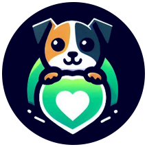
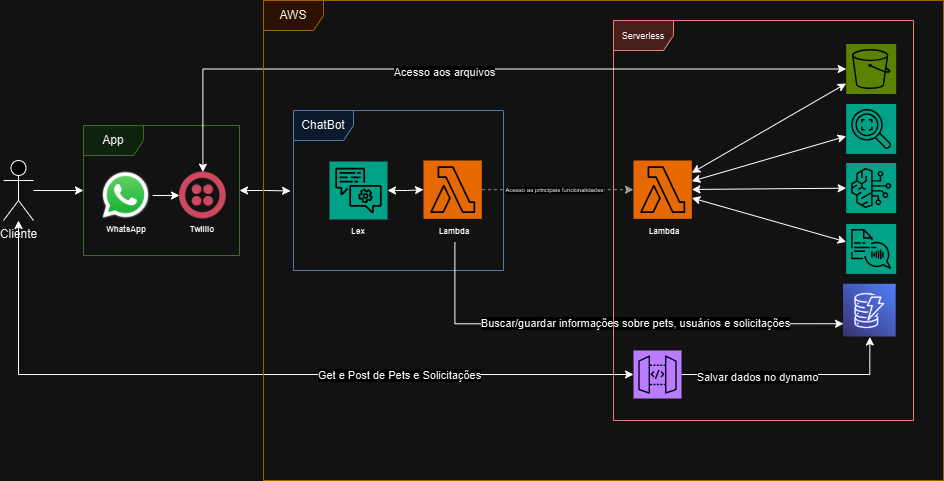

# Aumigo ChatBot

<p align="center">
  
</p>

## Objetivo/Proposta
Este projeto tem como objetivo desenvolver um chatbot para facilitar o processo de adoção de pets via WhatsApp. A solução visa automatizar e agilizar o atendimento da ONG, melhorando a experiência tanto para a equipe de atendimento quanto para os interessados em adotar. Futuramente, o chatbot permitirá centralizar e fornecer informações sobre pets disponíveis, requisitos para adoção e orientações gerais, tornando o processo mais eficiente e acessível. Com isso, espera-se reduzir o tempo de resposta e otimizar o fluxo de informações, minimizando a carga de trabalho para a equipe da ONG.

## Motivo da Escolha do Tema
Escolhemos este tema pela nossa paixão por animais e pelo desejo de aplicar IA e tecnologia para resolver problemas reais, especialmente no setor de proteção animal. Acreditamos que, por meio de um chatbot inteligente, é possível transformar a forma como ONGs e protetores independentes se comunicam com os futuros adotantes, facilitando o processo de adoção de maneira acessível e eficiente. Ao unir nossa afinidade com a tecnologia e o carinho pelos animais, buscamos desenvolver uma solução que não apenas simplifique o processo, mas também promova a adoção responsável, encurtando a jornada entre pets e novos lares.

## Tecnologias Utilizadas
Esses são os principais serviços que utilizaremos (Lembrando, é um esboço inicial, portanto pode haver mudanças!)
- **Lex**
- **Lambda**
- **Rekognition**
- **Polly**
- **DynamoDB**
- **Bedrock**
- **S3**
- **API Gateway**
- **Serverless Framework**
- **AWS CLI**

## Arquitetura Atual do Projeto


## Estrutura de Pasta
```
  ├── .gitignore
  ├── README.md
  ├── assets/
  │   ├── logo.png
  │   ├── sprint-9-10.jpg
  ├── aumigo/
  │   └── Aumigo-DRAFT-90PY4XOH...
  ├──chatbot-serverless/
        ├── intents/
        │   ├── adotarPet.py
        │   ├── doacaoOng.py
        │   ├── novoCadastro.py
        │   └── verificacaoCadastro.py
        ├── services/
        │   ├── bedrock_service.py
        │   ├── dynamo_service.py
        │   ├── lex_service.py
        │   ├── polly_service.py
        │   ├── rekognition_service.py
        │   └── s3_service.py
        ├── utils/
        │   ├── bedrock_utils.py
        │   ├── dynamo_utils.py
        │   ├── lex_utils.py
        │   ├── polly_utils.py
        │   ├── rekognition_utils.py
        │   └── s3_utils.py
        ├── .env
        ├── .envExample
        ├── .gitignore
        ├── handler.py
        ├── package.json
        ├── serverless.yml
        └── README.md
```

## Configuração do Ambiente AWS CLI e Serverless Framework

### **1. Configurar o AWS CLI com SSO**
1. Instale o **AWS CLI**: Baixe e instale a partir do [site oficial](https://aws.amazon.com/cli/).
   
2. Configure o AWS CLI para autenticação SSO:
   
   ```bash
   aws configure sso
   ```
   - Siga as instruções para inserir:
     - **SSO Start URL**
     - **SSO Region**
     - **Conta AWS**
     - **Perfil de Permissões**
     - **Nome do Perfil**
3. Teste o perfil configurado:
   
   ```bash
   aws s3 ls --profile aumigo-profile
   ```

### **2. Deploy do Projeto com Serverless Framework**

1. Instale o **Serverless Framework**:
   
   ```bash
   npm install -g serverless
   ```
2. Instale as dependências do projeto:
   
   ```bash
   cd chatbot-serverless
   npm install
   ```
3. Faça o deploy do projeto:
   
   ```bash
   serverless deploy --profile aumigo-profile
   ```

## Documentação do API Gateway
[SwaggerHub - ApiAumigo](https://app.swaggerhub.com/apis/JoaoHenriquedeOliveira/ApiAumigo/1.0.0)

## Dificuldades até o momento
 - Fazer uma boa validação dos slots e das intents, garantindo que o usuário não fuja do fluxo
 - Integração com o Twilio para envio de arquivos via WhatsApp
 - Integrar o Lex a serviços como S3 e Dynamo para persistir e buscar dados de clientes, pets e solicitações
 
## Autores

<div align="center">

<table>
  <tr>
    <td align="center">
      <a href="https://github.com/oliveirajh">
        <br>
        <sub>
          <b>Joao Henrique de Oliveira</b>
        </sub>
      </a>
    </td>
    <td align="center">
      <a href="https://github.com/joaoferrariac">
        <br>
        <sub>
          <b>Joao Victor Ferrari De Melo</b>
        </sub>
      </a>
    </td>
    <td align="center">
      <a href="https://github.com/Gustavo2022003">
        <br>
        <sub>
          <b>Gustavo Gutierrez</b>
        </sub>
      </a>
    </td>
    <td align="center">
      <a href="https://github.com/gabrielleg0mes">
        <br>
        <sub>
          <b>Maria Gabrielle</b>
        </sub>
      </a>
    </td>
    <td align="center">
      <a href="https://github.com/Kaykbr">
        <br>
        <sub>
          <b>Kayky Bezerra</b>
        </sub>
      </a>
    </td>
  </tr>
</table>

</div>

---

## Menção Honrosa

<div align="center">
<td align="center">
      <a href="https://github.com/LucasTeodoro1009">
        <br>
        <sub>
          <b>Lucas Gabriel Teodoro</b>
        </sub>
      </a>
    </td>
</div>
